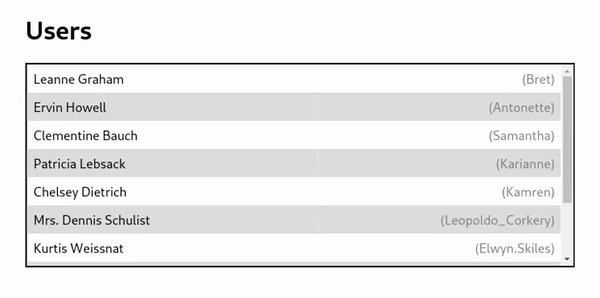
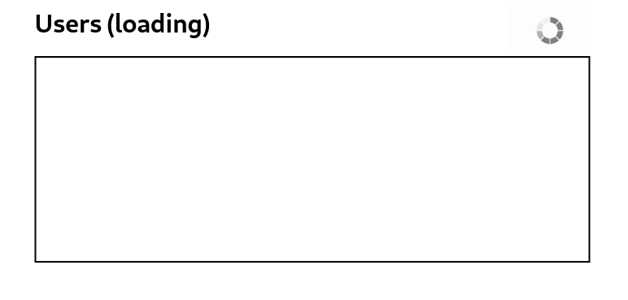
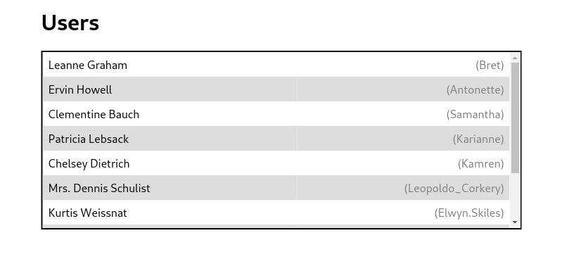
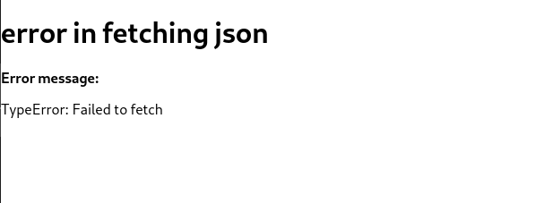

# List-React-Test 

A simple react application that fetches JSON of users from https://jsonplaceholder.typicode.com/users, then displays it in list as required in test.

##  Features!

  - popover on hover
  - scrollable user list
  - loading message
 - no library used except "react" and "react-dom"
### Additional features

  - Error message on failed fetch request 
  - Responsive design


### Used Api 

* [jsonplaceholder](https://jsonplaceholder.typicode.com/users) - provides a JSON of 10 users 
 https://jsonplaceholder.typicode.com/users
## Installation
For dev environement:
Install the dependencies and start the server.

```sh
$ git clone https://github.com/siddharthshah3030/list-react-task
$ cd list-react-task
$ yarn
$ yarn start
```

For production environments:
Just run build command 
Which will generate bundle in build folder inside project root
```sh
$ yarn run build
```
## Screen Shots





##  contributor 
 [Siddharth Shah](https://github.com/siddharthshah3030)


